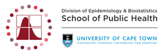

<br/>
<br/>

<br/>
<br/>


# Modelling non-linear associations 
## Presentation & Code for Seminars in Epidemiology 2026 

<br/>
  
## Repository Structure

```
.
├── assets/        # logos, html code & custom css for presentation
├── images/        # Static files 
├── index.qmd      # Presentation (Quarto reveal.js slides)
├── renv.lock      # pinned package versions
├── renv/          # renv project infrastructure
└── README.md
```

## Requirements

Package versions are managed with [renv](https://rstudio.github.io/renv/).
The `renv.lock` file in this repo pins the exact versions used.
 
No manual `install.packages()` calls are needed — see **Getting started** below.

## Getting started

1. Clone the repo. 

2. Open the project in R (e.g. via the `.Rproj` file, if present) so `renv`
   activates automatically. If it doesn't activate on its own, run:

   ```r
   renv::activate()
   ```

3. Restore the exact package versions pinned in `renv.lock`:

   ```r
   renv::restore()
   ```

5. Render the index.qmd file:

   ```r
   quarto_render("index.qmd")
   ```


## License

<!-- MIT License Badge (Optional) -->
<p>
  <a href="https://opensource.org/licenses/MIT">
    
  </a>
</p>

<p>Copyright &copy; <span id="current-year">2026</span> - Annibale Cois, University of Cape Town, <a href="mailto:annibale.cois@uct.ac.za"> annibale.cois@uct.ac.za</a></p>

<p>Permission is hereby granted, free of charge, to any person obtaining a copy of this software and associated documentation files (the &quot;Software&quot;), to deal in the Software without restriction, including without limitation the rights to use, copy, modify, merge, publish, distribute, sublicense, and/or sell copies of the Software, and to permit persons to whom the Software is furnished to do so, subject to the following conditions:</p>

<p>The above copyright notice and this permission notice shall be included in all copies or substantial portions of the Software.</p>

<p><strong>THE SOFTWARE IS PROVIDED &quot;AS IS&quot;, WITHOUT WARRANTY OF ANY KIND, EXPRESS OR IMPLIED, INCLUDING BUT NOT LIMITED TO THE WARRANTIES OF MERCHANTABILITY, FITNESS FOR A PARTICULAR PURPOSE AND NONINFRINGEMENT. IN NO EVENT SHALL THE AUTHORS OR COPYRIGHT HOLDERS BE LIABLE FOR ANY CLAIM, DAMAGES OR OTHER LIABILITY, WHETHER IN AN ACTION OF CONTRACT, TORT OR OTHERWISE, ARISING FROM, OUT OF OR IN CONNECTION WITH THE SOFTWARE OR THE USE OR OTHER DEALINGS IN THE SOFTWARE.</strong></p>

## Contact

Annibale Cois, <a href="mailto: annibale.cois@uct.ac.za">annibale.cois@uct.ac.za</a>
