<h1> Modelling <br>non-linear associations </h1>
<h2> Approaches, pros and cons, caveats</h2>
<hr>
<h4> Annibale Cois</h4>
<h6 style = "font-size: 60%;">Senior Specialist Scientist, South African Medical Research Council</h6>  
<h6 style = "font-size: 60%;">Honorary Senior Lecturer, School of Public Health, University of Cape Town</h6>   
<br/>
<h6 style = "font-size: 60%;"> `r fontawesome::fa("earth-americas", "#AA0000")` &nbsp; [annibalecois.github.io/](https://annibalecois.github.io/)
<h6 style = "font-size: 60%;"> `r fontawesome::fa("orcid", "#A6CE39")` &nbsp; [orcid.org/0000-0002-7014-6510](https://orcid.org/0000-0002-7014-6510)
<h6 style = "font-size: 60%;"> `r fontawesome::fa("github", "black")` &nbsp; [github.com/annibalecois](https://github.com/annibalecois)
<div style = "position:absolute; bottom:0px; left:0px;"><h3> 2026-09-29 </h3></div>

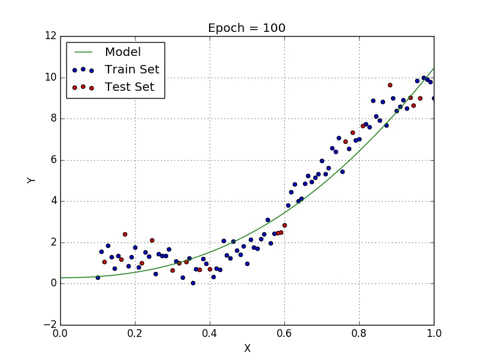{.absolute top=350 left=800 width="900"}

```{r}
#| label: Initialise
#| include: false

# Libraries

library(dplyr)

library(ggplot2)
library(ggthemes)
theme_set(theme_gdocs())

library(mgcv)
library(splines)
library(cplm)
library(lspline)
library(npreg)
library(mfp)

```


## {.center}

::: {style="font-size: 200%!important; text-align: center;"}
$$
y_i = \beta_0 +\beta_1 x_i + \varepsilon_i  \\
\varepsilon_i \sim \mathcal{N}(0, \sigma^2)
$$
:::

::: {.fragment}

* $y_i$ is the response (dependent variable) for observation $i$
* $x_i$ is the predictor (independent variable)
* $\beta_0$ is the intercept and $\beta_1$ is the slope
* $\varepsilon_i$ is the random error term

:::

::: notes
1. **Linearity.** The conditional mean of $Y$ is a linear function of $x$ and is correctly specified:
2. **Zero-mean errors (exogeneity).** The errors have mean zero and are uncorrelated with the predictor:
3. **Homoscedasticity (constant variance).**
4. **Independence (no autocorrelation).** Errors are uncorrelated across observations:
5. **Variation in the predictor.** The $x_i$ are not all identical, so the slope is identifiable:
6. **Normality of errors** (needed for exact small-sample inference, not for unbiasedness of the least-squares estimators):
:::

## {.center}

::: {style="font-size: 200%!important; text-align: center;"}
$$
E(y_i) = \beta_0 +\beta_1 x_i \\
y_i \sim \mathcal{N}(E(y_i), \sigma^2)
$$
:::

::: notes
The mean of the distribution of the observed values of each variable for each value of the predictor is a linear function of the value of the predictor
Only the mean of the distribution of the outcome varies with the predictor
::: 

## {.center}

::: {style="font-size: 200%!important; text-align: center;"}
$$
E(bmi_i) = \beta_0 +\beta_1 age_i \\
bmi_i \sim \mathcal{N}(E(bmi_i), \sigma^2) \\
\\
\beta_0 = 18\ Kg/m^2 \quad \quad \beta_1 = 0.2\ Kg/m^2/year
$$
:::

## {.center} 

{fig-align="center" width="80%"} 

## {.center} 

{fig-align="center" width="80%"}

## {.center} 

{fig-align="center" width="80%"}

## {.center} 

{fig-align="center" width="80%"}

## {.center}

::: {style="font-size: 300%!important; text-align: center;"}

What if it is not the case?

. . . 

$$
   \mathbb{E}[Y_i \mid x_i] \neq \beta_0 + \beta_1 x_i 
$$
:::


## Example Data {.center}
  
  
```{r}
#| echo: true
set.seed(2709)    

# Generating the predictor
X <- seq(from = -5, to = 5, by = .1) 

# Generating the 'true' outcome 
B <- t(bs(X, knots = seq(-5, 5, 1), degree = 3, intercept = FALSE))  # creating a B-spline 
num_basis <- nrow(B)
a0 <- 1  # Intercept 
a1 <- 0.2  # slope of the linear term
a <- rnorm(num_basis, 0, 1) # random coefficients for the B-spline  
Y_true <- as.vector(a0 + a1 * X + a %*% B) # generating the output

# Adding some noise 
Y <- Y_true + rnorm(length(X), 0, .20) # adding noise

# Consolidate
D <- data.frame(cbind(X, Y, Y_true))

head(D)
```

## 

```{r}
ggplot(D, aes(x = X, y = Y)) +
  geom_point(alpha = 0.5, col = "red") +
  geom_line(aes(y = Y_true)) +
  theme(plot.background = element_blank())
```

## Assuming linearity?

```{r}
mod_p1 <- lm(Y ~ X)
MOD <- rep(1, 101)
YP <- predict(mod_p1)
MP1 <- data.frame(cbind(MOD, X, YP), stringsAsFactors = FALSE)
```
<br/>

::: {.columns}

::: {.column width="65%" .fragment}

```{r}
#| echo: true
ggplot(MP1, aes(x = X, y = Y)) +
  geom_point(data = D, alpha = 0.5, col = "red") +
  geom_line(data = D, aes(y = YP), col = "black", lty = "dashed") 
```

:::

::: {.column width="35%" .fragment}

```{r}
AIC(mod_p1)  # AIC
```
<br/>

```{r}
BIC(mod_p1)  # BIC 
```
:::

:::

## (Generalised) Additive Models  

## {background-image="images/gam_1.PNG"}

## {.center}

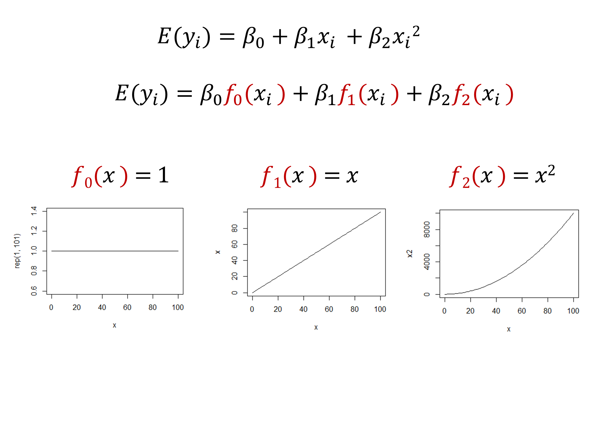{fig-align="center" width="80%"}

## {.center}

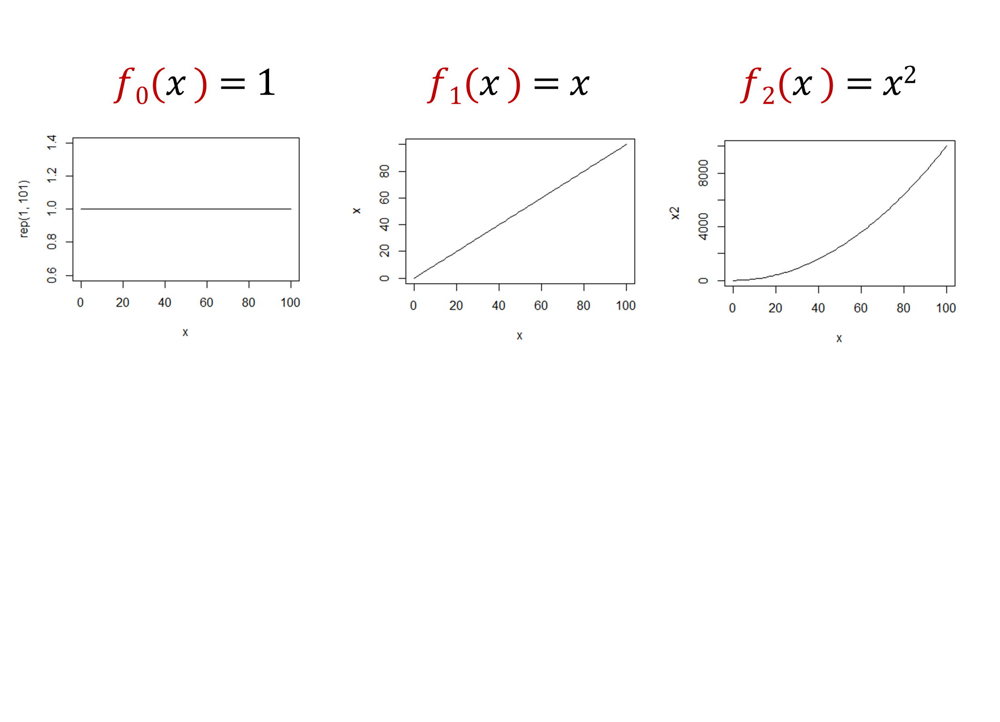{fig-align="center" width="80%"} 

## {.center}

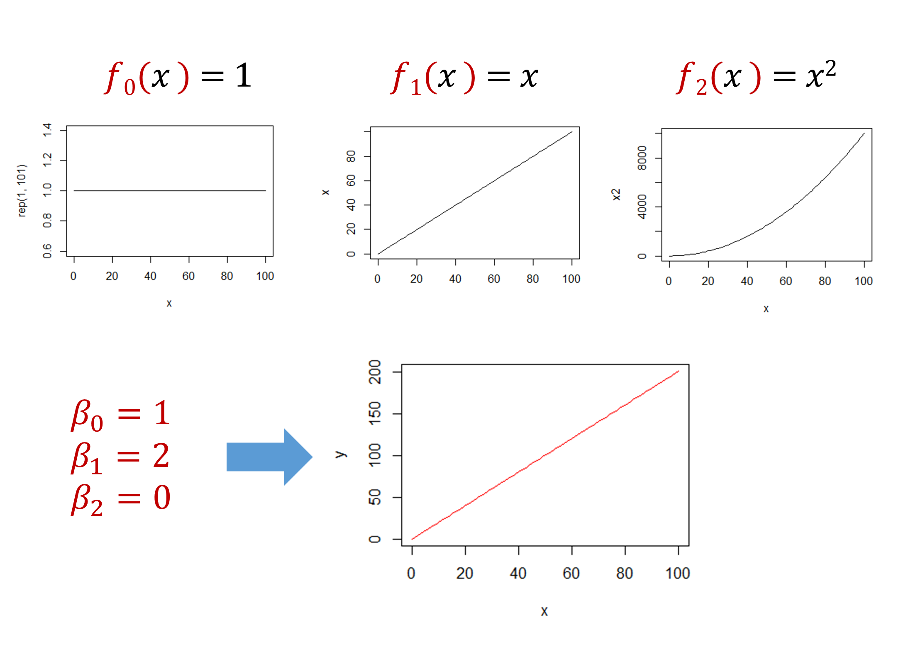{fig-align="center" width="80%"}

## {.center}

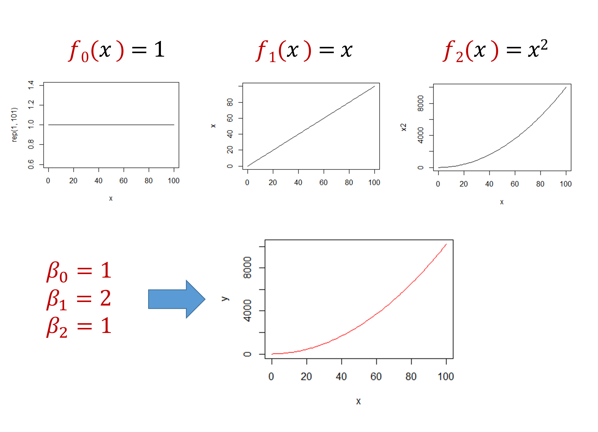{fig-align="center" width="80%"}

## {.center}

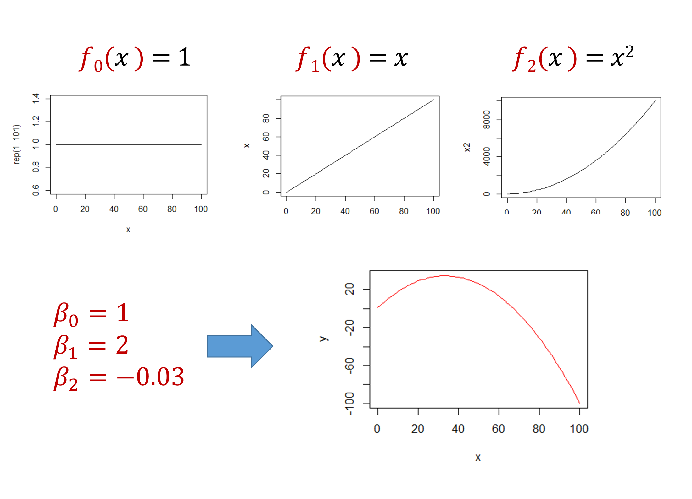{fig-align="center" width="80%"}

## {.center}

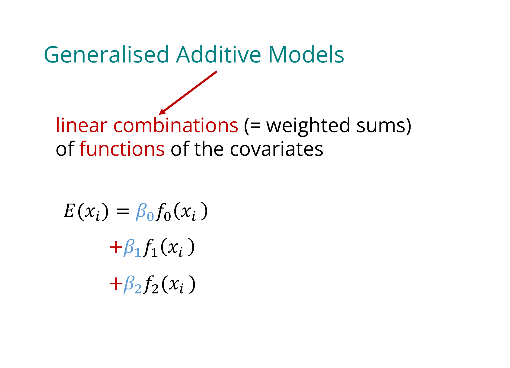{fig-align="center" width="80%"}

## {.center}

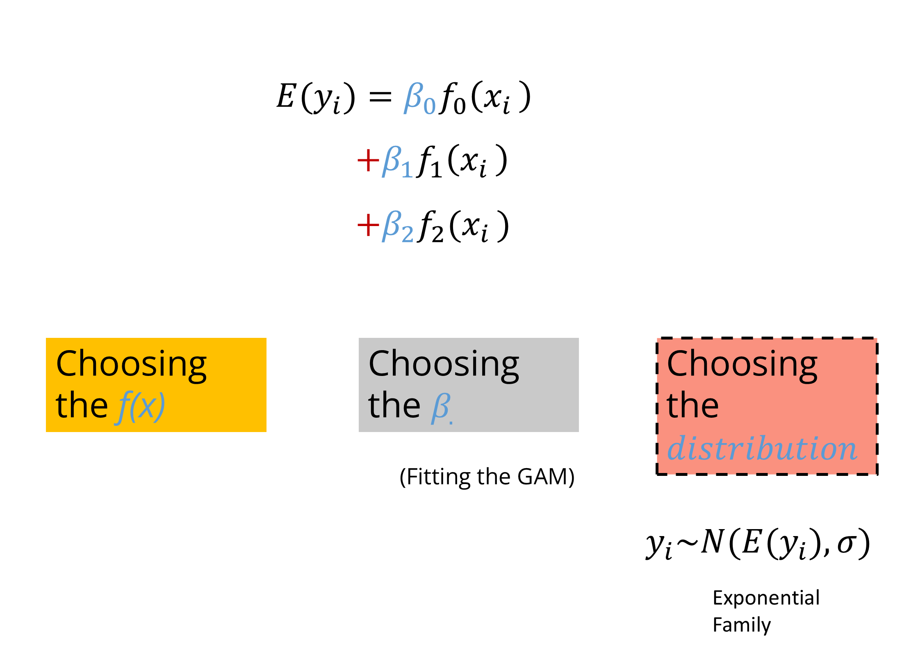{fig-align="center" width="80%"}


## Polynomials (powers of the predictor)


$$
y_1 = \beta_0 + \sum_{k=1}^{n}x_i^k + \varepsilon
$$

```{r}
mod_p2 <- lm(Y ~ X + I(X^2))
MOD <- rep(2, 101)
YP <- predict(mod_p2)
MP2 <- data.frame(cbind(MOD, X, YP), stringsAsFactors = FALSE)

mod_p3 <- lm(Y ~ X + I(X^2) + I(X^3))
MOD <- rep(3, 101)
YP <- predict(mod_p3)
MP3 <- data.frame(cbind(MOD, X, YP), stringsAsFactors = FALSE)

mod_p4 <- lm(Y ~ poly(X, 4))
MOD <- rep(4, 101)
YP <- predict(mod_p4)
MP4 <- data.frame(cbind(MOD, X, YP), stringsAsFactors = FALSE)

mod_p5 <- lm(Y ~ poly(X, 10))
MOD <- rep(10, 101)
YP <- predict(mod_p5)
MP5 <- data.frame(cbind(MOD, X, YP), stringsAsFactors = FALSE)

mod_p6 <- lm(Y ~ poly(X, 12))
MOD <- rep(12, 101)
YP <- predict(mod_p6)
MP6 <- data.frame(cbind(MOD, X, YP), stringsAsFactors = FALSE)

mod_p7 <- lm(Y ~ poly(X, 18))
MOD <- rep(18, 101)
YP <- predict(mod_p7)
MP7 <- data.frame(cbind(MOD, X, YP), stringsAsFactors = FALSE)
```

##

```{r}
#| echo: false
DPOL <- rbind(
  MP1, MP2, MP3, MP4, MP5, MP6, MP7
) |> rename(Model = MOD)

ggplot(subset(DPOL, Model >1), aes(x = X, y = Y)) +
  geom_point(data = D, alpha = 0.5, col = "red") +
  geom_line(aes(y = YP, color = factor(Model), group = factor(Model))) +
  labs(color = "Degree")

```

## 

```{r}
IC <- data.frame(Model = c(1:7), 
                 IC = c(rep("AIC",7),rep("BIC",7)),
                 Value = c(c(AIC(mod_p1),AIC(mod_p2),AIC(mod_p3),AIC(mod_p4),AIC(mod_p5),AIC(mod_p6),AIC(mod_p7)),
                                        c(BIC(mod_p1),BIC(mod_p2),BIC(mod_p3),BIC(mod_p4),BIC(mod_p5),BIC(mod_p6),BIC(mod_p7))))

ggplot(IC, aes(x = Model, y = Value)) +
  geom_point() +
  geom_line() +
  facet_grid(~IC)

```


## 

```{r}
mod_p7 <- lm(Y ~ poly(X, 18))
NEWX <- seq(-5,6,by = 0.1)
MOD <- rep(18, length(NEWX))
YP <- predict(mod_p7, newdata = data.frame(X = NEWX))
MP7a <- data.frame(cbind(MOD, X = NEWX, YP), stringsAsFactors = FALSE) |> rename(Model = MOD)

ggplot(MP7a, aes(x = X, y = Y)) +
  geom_point(data = D, alpha = 0.5, col = "red") +
  geom_line(aes(y = YP, color = factor(Model), group = factor(Model))) +
  labs(color = "Degree")

```

## Fractional Polynomial (fractional powers of the predictor)

```{r}
#| echo: false
mod_p7b <- mfp(Y ~ fp(X), family = gaussian, data = D)
MOD <- rep(0, 101)
YP <- predict(mod_p7b)
MP7b <- data.frame(cbind(MOD, X, YP), stringsAsFactors = FALSE)

```

<br/>

::: {.fragment}

```{r}
#| echo: false

ggplot(MP7b, aes(x = X, y = Y)) +
  geom_point(data = D, alpha = 0.5, col = "red") +
  geom_line(aes(y = YP))
```

::: 

::: notes

Definition: 
A fractional polynomial models non-linear covariate effects using powers chosen from a predefined set (typically -2, -1, -0.5, 0, 0.5, 1, 2, 3).

Algorithm: It cycles through continuous variables, using backward elimination and closed-test procedures to decide if a variable should be excluded, kept linear, or transformed into a 1st-degree (FP1) or 2nd-degree (FP2) fractional polynomial.

:::

## Splines {background-image="images/gam_9.PNG"}

## Regression splines {.center}

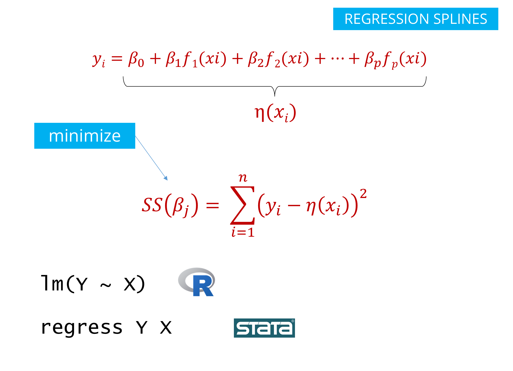{fig-align="center" width="80%"}

## Regression splines: truncated bases (piecewise linear)  

## {.center}

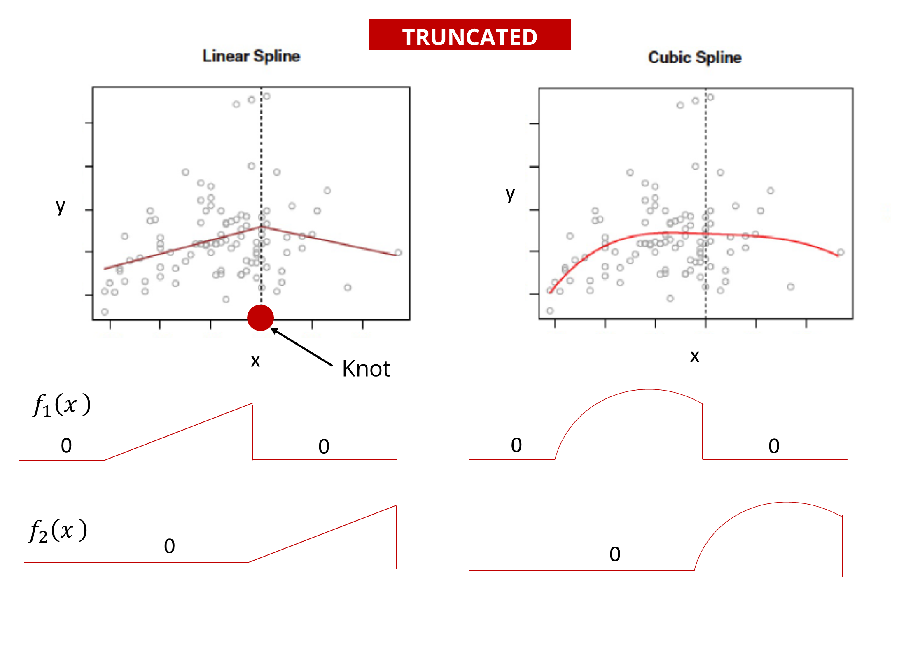{fig-align="center" width="80%"}

## {.center}

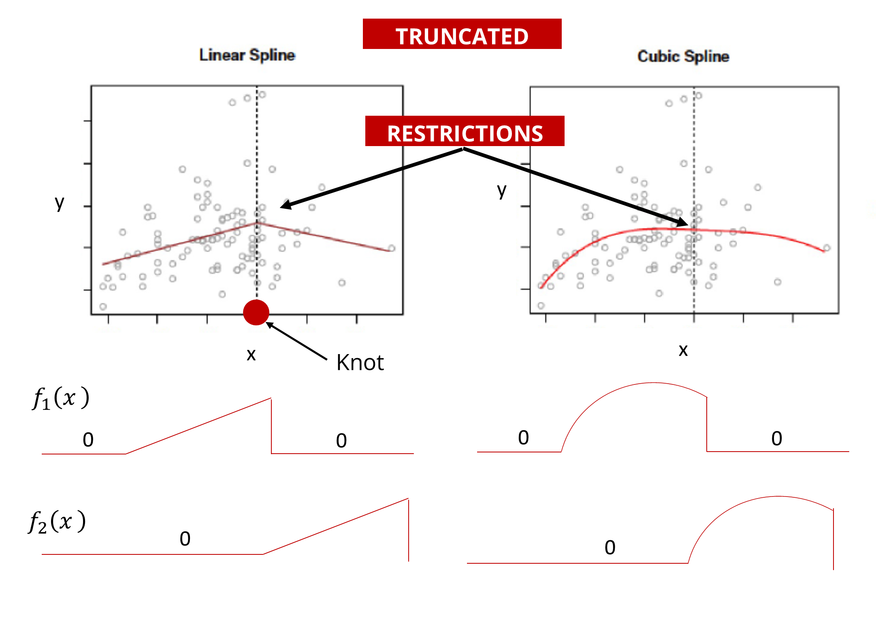{fig-align="center" width="80%"}

##

```{r}
IKNOT <- 5
KNOTS <- c(-5, seq(-5, 5, 10 / (IKNOT + 1))[2:(IKNOT + 1)], 5)
DF <- length(KNOTS) - 1 # Degrees of freedom
SPLINE <- lspline(X, knots = KNOTS, marginal = FALSE)[, 2:DF]
colnames(SPLINE) <- paste(rep("S", (DF - 1)), c(1:(DF - 1)), sep = "")
MDATA <- data.frame(cbind(Y, SPLINE))
form <- as.formula(paste("Y ~ 1 + ", paste(paste(colnames(SPLINE), sep = ""), collapse = " + ")))
mod_t1 <- lm(form, data = MDATA)
MOD <- rep(8, 101)
YP <- predict(mod_t1)
MT1 <- data.frame(cbind(MOD, X, YP), stringsAsFactors = FALSE)
```

<br/>

::: {.fragment}

```{r}
#| echo: false

ggplot(MT1, aes(x = X, y = Y)) +
  geom_point(data = D, alpha = 0.5, col = "red") +
  geom_line(aes(y = YP))
```

:::

## 

```{r}
IKNOT <- 15
KNOTS <- c(-5, seq(-5, 5, 10 / (IKNOT + 1))[2:(IKNOT + 1)], 5)
DF <- length(KNOTS) - 1 # Degrees of freedom
SPLINE <- lspline(X, knots = KNOTS, marginal = FALSE)[, 2:DF]
colnames(SPLINE) <- paste(rep("S", (DF - 1)), c(1:(DF - 1)), sep = "")
MDATA <- data.frame(cbind(Y, SPLINE))
form <- as.formula(paste("Y ~ 1 + ", paste(paste(colnames(SPLINE), sep = ""), collapse = " + ")))
mod_t2 <- lm(form, data = MDATA)
MOD <- rep(9, 101)
YP <- predict(mod_t2)
MT2 <- data.frame(cbind(MOD, X, YP), stringsAsFactors = FALSE)
```

<br/>

```{r}
#| echo: false

ggplot(MT2, aes(x = X, y = Y)) +
  geom_point(data = D, alpha = 0.5, col = "red") +
  geom_line(aes(y = YP))
```

## Regression splines: truncated bases (powers)   

```{r}
IKNOT <- 5
KNOTS <- c(-5, seq(-5, 5, 10 / (IKNOT + 1))[2:(IKNOT + 1)], 5)
DF <- length(KNOTS) - 1 # Degrees of freedom
SPLINE <- tp(X, degree = 3, knots = KNOTS)$Z[, 1:DF]
colnames(SPLINE) <- paste(rep("S", DF), c(1:DF), sep = "")
MDATA <- data.frame(cbind(Y, SPLINE))
form <- as.formula(paste("Y ~ 1 + ", paste(paste(colnames(SPLINE), sep = ""), collapse = " + ")))
mod_tp1 <- lm(form, data = MDATA)
MOD <- rep(10, 101)
YP <- predict(mod_tp1)
MTP1 <- data.frame(cbind(MOD, X, YP), stringsAsFactors = FALSE)
```

<br/>

::: {.fragment}

```{r}
#| echo: false

ggplot(MTP1, aes(x = X, y = Y)) +
  geom_point(data = D, alpha = 0.5, col = "red") +
  geom_line(aes(y = YP))
```

:::

## 

```{r}
IKNOT <- 15
KNOTS <- c(-5, seq(-5, 5, 10 / (IKNOT + 1))[2:(IKNOT + 1)], 5)
DF <- length(KNOTS) - 1 # Degrees of freedom
SPLINE <- tp(X, degree = 3, knots = KNOTS)$Z[, 1:DF]
colnames(SPLINE) <- paste(rep("S", DF), c(1:DF), sep = "")
MDATA <- data.frame(cbind(Y, SPLINE))
form <- as.formula(paste("Y ~ 1 + ", paste(paste(colnames(SPLINE), sep = ""), collapse = " + ")))
mod_tp2 <- lm(form, data = MDATA)
MOD <- rep(11, 101)
YP <- predict(mod_tp2)
MTP2 <- data.frame(cbind(MOD, X, YP), stringsAsFactors = FALSE)
```

<br/>

```{r}
#| echo: false

ggplot(MTP2, aes(x = X, y = Y)) +
  geom_point(data = D, alpha = 0.5, col = "red") +
  geom_line(aes(y = YP))
```

## Regression splines: `natural` cubic splines

```{r}
IKNOT <- 5
KNOTS <- c(-5, seq(-5, 5, 10 / (IKNOT + 1))[2:(IKNOT + 1)], 5)
DF <- length(KNOTS) - 1 # Degrees of freedom
SPLINE <- ns(X, knots = KNOTS[2:(length(KNOTS) - 1)], intercept = FALSE, Boundary.knots = c(-5, 5))
colnames(SPLINE) <- paste(rep("S", DF), colnames(SPLINE), sep = "")
MDATA <- data.frame(cbind(Y, SPLINE))
form <- as.formula(paste("Y ~ 1 + ", paste(paste(colnames(SPLINE), sep = ""), collapse = " + ")))
mod_ns1 <- lm(form, data = MDATA)
MOD <- rep(12, 101)
YP <- predict(mod_ns1)
MNS1 <- data.frame(cbind(MOD, X, YP), stringsAsFactors = FALSE)
```

```{r}
#| include: false
IKNOT <- 15
KNOTS <- c(-5, seq(-5, 5, 10 / (IKNOT + 1))[2:(IKNOT + 1)], 5)
DF <- length(KNOTS) - 1 # Degrees of freedom
SPLINE <- ns(X, knots = KNOTS[2:(length(KNOTS) - 1)], intercept = FALSE, Boundary.knots = c(-5, 5))
colnames(SPLINE) <- paste(rep("S", DF), colnames(SPLINE), sep = "")
MDATA <- data.frame(cbind(Y, SPLINE))
form <- as.formula(paste("Y ~ 1 + ", paste(paste(colnames(SPLINE), sep = ""), collapse = " + ")))
mod_ns2 <- lm(form, data = MDATA)
MOD <- rep(13, 101)
YP <- predict(mod_ns2)
MNS2 <- data.frame(cbind(MOD, X, YP), stringsAsFactors = FALSE)
```

:::: {.columns}

::: {.column width="50%" }

```{r}
#| echo: false
ggplot(MNS1, aes(x = X, y = Y)) +
  geom_point(data = D, alpha = 0.5, col = "red") +
  geom_line(aes(y = YP))
```


:::

::: {.column width="50%"}
```{r}
#| echo: false
ggplot(MNS2, aes(x = X, y = Y)) +
  geom_point(data = D, alpha = 0.5, col = "red") +
  geom_line(aes(y = YP))
```

:::

:::

## Regression splines: B-splines 

## {.center}

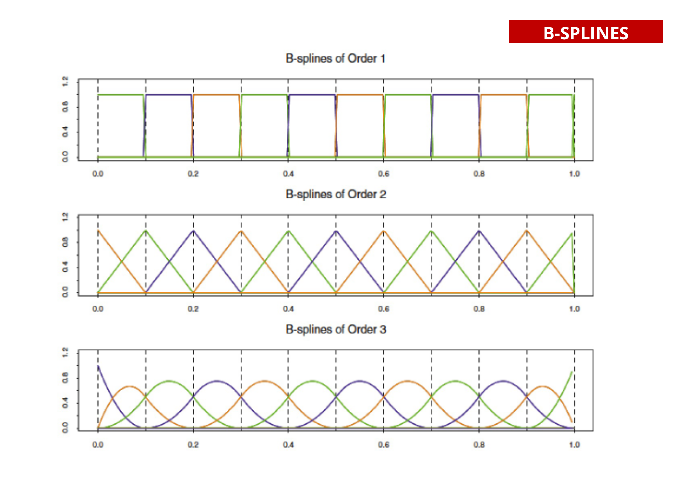{fig-align="center" width="80%"}

##

```{r}
IKNOT <- 5
KNOTS <- c(-5, seq(-5, 5, 10 / (IKNOT + 1))[2:(IKNOT + 1)], 5)
DF <- length(KNOTS) - 1 # Degrees of freedom
SPLINE <- bs(X, knots = KNOTS[2:(length(KNOTS) - 1)], intercept = FALSE, Boundary.knots = c(-5, 5))
colnames(SPLINE) <- paste(rep("S", DF), colnames(SPLINE), sep = "")
MDATA <- data.frame(cbind(Y, SPLINE))
form <- as.formula(paste("Y ~ 1 + ", paste(paste(colnames(SPLINE), sep = ""), collapse = " + ")))
mod_bs1 <- lm(form, data = MDATA)
MOD <- rep(14, 101)
YP <- predict(mod_bs1)
MBS1 <- data.frame(cbind(MOD, X, YP), stringsAsFactors = FALSE)
```

<br/>

```{r}
#| echo: false

ggplot(MBS1, aes(x = X, y = Y)) +
  geom_point(data = D, alpha = 0.5, col = "red") +
  geom_line(aes(y = YP))
```

## {.center}

{fig-align="center" width="80%"}


## Smoothing splines {background-image="images/gam_9.PNG"}

## {.center}

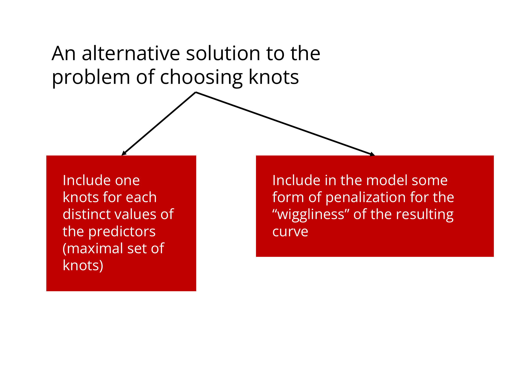{fig-align="center" width="80%"}

## {.center}

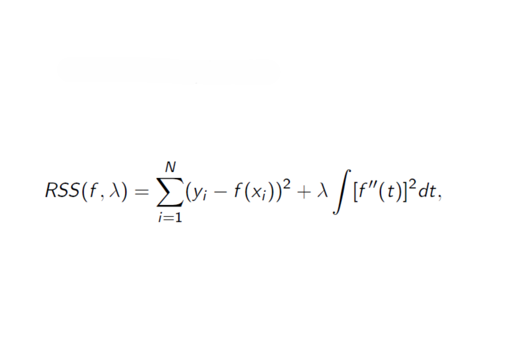{fig-align="center" width="80%"}

## {.center}

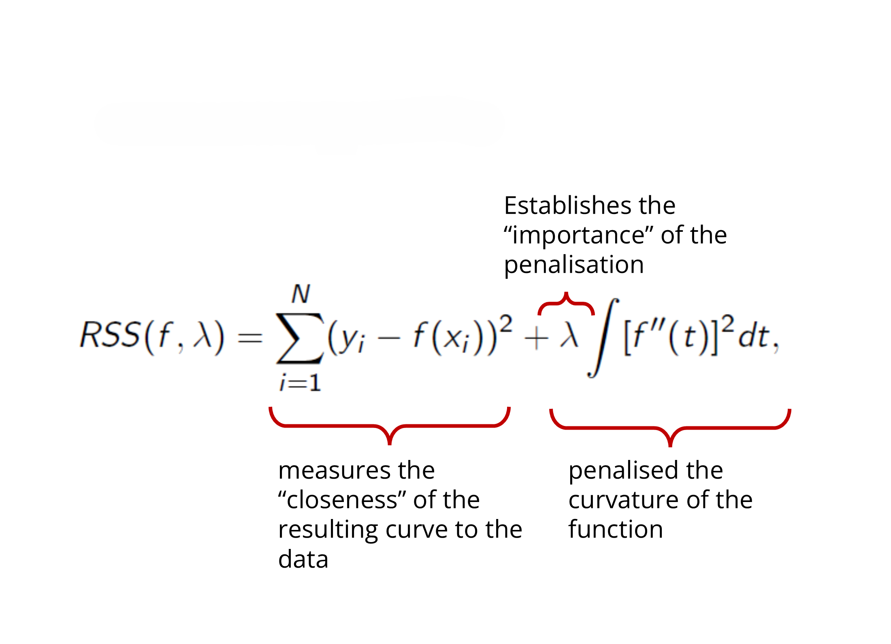{fig-align="center" width="80%"}


## Smoothing splines: thin-plate  

```{r}

K <- 5

mod_pl1 <- gam(Y ~ s(X, k = K, bs = "tp"))
MOD <- rep(15, 101)
YP <- predict(mod_pl1)
MPL1 <- data.frame(cbind(MOD, X, YP), stringsAsFactors = FALSE)

```

```{r}
#| echo: false

ggplot(MPL1, aes(x = X, y = Y)) +
  geom_point(data = D, alpha = 0.5, col = "red") +
  geom_line(aes(y = YP))
```

## 

```{r}
#| include: false

K <- 5

mod_pl1 <- gam(Y ~ s(X, k = K, bs = "tp"))
MOD <- rep(5, 101)
YP <- predict(mod_pl1)
MPL1 <- data.frame(cbind(MOD, X, YP), stringsAsFactors = FALSE)

K <- 20

mod_pl2 <- gam(Y ~ s(X, k = K, bs = "tp"))
MOD <- rep(20, 101)
YP <- predict(mod_pl2)
MPL2 <- data.frame(cbind(MOD, X, YP), stringsAsFactors = FALSE)

K <- 80

mod_pl3 <- gam(Y ~ s(X, k = K, bs = "tp"))
MOD <- rep(80, 101)
YP <- predict(mod_pl3)
MPL3 <- data.frame(cbind(MOD, X, YP), stringsAsFactors = FALSE)

K <- 100

mod_pl4 <- gam(Y ~ s(X, k = K, bs = "tp"))
MOD <- rep(100, 101)
YP <- predict(mod_pl4)
MPL4 <- data.frame(cbind(MOD, X, YP), stringsAsFactors = FALSE)

DTP <- rbind(
  MPL1, MPL2, MPL3, MPL4
) |> mutate(Model = factor(MOD))


```


```{r}
#| echo: false

ggplot(DTP, aes(x = X, y = Y)) +
  geom_point(data = D, alpha = 0.5, col = "red") +
  geom_line(aes(y = YP, col = Model))
```

## 

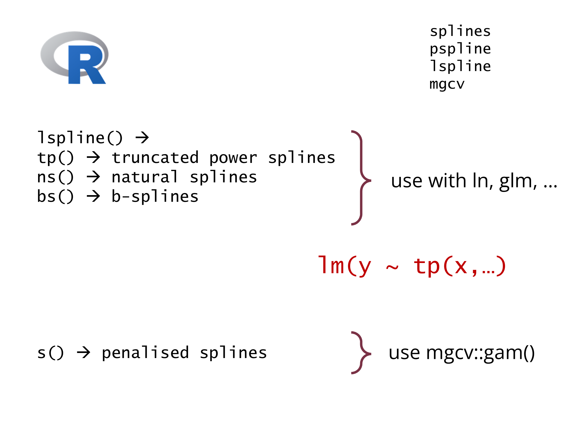{fig-align="center" width="90%"}


## 


{fig-align="center" width="90%"}


